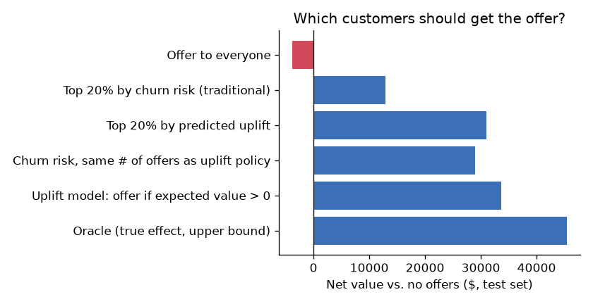
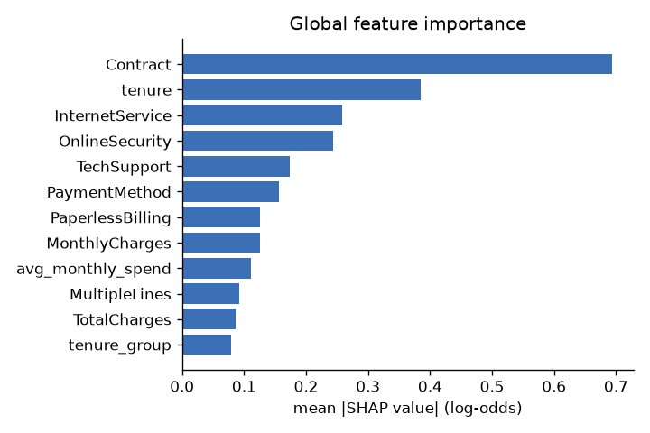
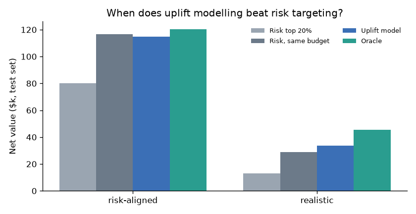

# 📉 Churn & Retention Optimizer

[](https://github.com/anshuman83-40/churn-retention-optimizer/actions/workflows/ci.yml)

**Predict which customers will churn, explain why, and decide who is actually worth a retention offer.**

Most churn projects stop at *"who is likely to leave?"*. That is the wrong question for a marketing budget:
some high-risk customers will leave no matter what (**lost causes**), some would have stayed anyway
(**sure things**), and some react badly to being contacted (**sleeping dogs**). This project adds a
**causal uplift model** that estimates how much a discount *changes* each customer's behaviour, and
targets offers by expected profit.

**🔗 Live demo: [churn-retention-optimizer.onrender.com](https://churn-retention-optimizer.onrender.com)** · **API docs: [/docs](https://churn-retention-optimizer.onrender.com/docs)**

> Free hosting: the first visit after a quiet period takes ~1 minute while the server wakes up.

<!-- Add a screenshot of the dashboard: docs/dashboard.png -->

## Dashboard

A custom web app (HTML/CSS/JS + Chart.js) served by the FastAPI backend, scoring all 7,043 customers:

- **Dashboard**: KPIs (predicted churn rate, 12-month revenue at risk, customers worth saving), churn by
  tenure (actual vs predicted), uplift segments, top SHAP churn drivers, and a searchable, sortable,
  filterable customer table with CSV export
- **Customer insight panel**: churn probability, revenue at risk, per-customer SHAP factors, offer economics
  and recommended actions you can add to a retention plan
- **What-If Simulator**: edit any customer profile and watch risk and the offer decision update live
- **Retention Actions**: your campaign plan, downloadable as CSV
- **Model Performance** and **How It Works** pages

Every number on screen comes from the models. There are no invented names, dates or trends.

**Uplift segments** used across the app:

| Segment | Meaning | Action |
|---|---|---|
| Persuadable | Offer expected to pay off (> $20 expected value) | Send the offer |
| Lost Cause | High risk, but a discount won't change the outcome | Fix the service issue instead |
| Sleeping Dog | Offer is likely to *increase* churn | Do not contact |
| Loyal | Low churn risk | No retention spend |
| Monitor | Moderate risk, offer not worth it yet | Watch |



## Results

### 1. Churn prediction (IBM Telco dataset, 7,043 customers, stratified 80/20 split)

| Model | ROC-AUC | PR-AUC | F1 | Recall | Brier |
|---|---|---|---|---|---|
| Logistic Regression (baseline) | 0.845 | 0.651 | 0.624 | 0.709 | 0.166 |
| **XGBoost (tuned, 30×5-fold CV)** | **0.847** | **0.668** | **0.639** | 0.711 | **0.135** |

- **2.8x lift** in the top-risk decile: 10% of customers contain 28% of churners.
- XGBoost beats the linear baseline only slightly on ranking (AUC), but is clearly better calibrated (Brier
  0.135 vs 0.166). That matters because the profit calculation uses the probabilities directly.
- Decision threshold chosen by maximising F1 on out-of-fold training predictions (no test leakage).

**Top churn drivers (SHAP):** contract type ≫ tenure > internet service > online security > tech support.



### 2. Who should get the retention offer? (uplift modelling)

Offer: 20% off for 3 months. A retained customer is valued at 12 months of revenue.
Evaluated on 2,113 held-out customers against the **known true effect** (see methodology).

| Targeting policy (realistic scenario) | Offers sent | Churners prevented | Net value |
|---|---|---|---|
| Offer to everyone | 2,113 | 84.9 | **−$3,745** (loses money) |
| Top 20% by churn risk (traditional) | 422 | 27.7 | $12,913 |
| **Top 20% by predicted uplift** | 422 | 65.3 | **$31,013 (2.4x)** |
| Churn risk, same budget as uplift policy | 865 | 69.4 | $28,921 |
| **Uplift model: offer if expected value > 0** | 865 | 78.6 | **$33,661** |
| Oracle (true effects, upper bound) | 563 | 86.7 | $45,383 |

**With the same budget, uplift targeting prevents 2.4x more churn and earns 2.4x more value than risk targeting.**
The S-learner was selected over T- and X-learners by Qini coefficient (correlation with the true effect 0.78).

### 3. When is uplift modelling *not* worth it?

I also ran a **risk-aligned** scenario where the riskiest customers are also the most persuadable.
There, plain churn-risk targeting is already near-optimal: at the same budget it scores $116.6k vs $114.9k for
the uplift policy. Uplift modelling earns its complexity only when treatment effect and risk diverge
(lost causes, sleeping dogs). This is worth checking with a pilot A/B test before building one.



## Methodology

```
raw CSV ──► clean + feature engineering ──► XGBoost churn model ──► SHAP explanations
                                     │                      │
                                     │      out-of-fold p0(x) (leakage-free baselines)
                                     ▼                      ▼
                         simulated randomized offer experiment (T ~ Bernoulli 0.5)
                                     │
                                     ▼
              S / T / X meta-learners ──► uplift τ̂(x) ──► expected value ──► offer decision
                                                                             │
                                         FastAPI  /predict  ◄────────────────┤
                                         Web dashboard (/)  ◄────────────────┘
```

**Why semi-synthetic?** Public churn datasets have no record of who received offers, so uplift cannot be
learned from them directly. Following common practice in causal-ML research, the experiment is simulated
*on top of the real customers*:

1. `p0(x)`: each customer's real churn probability (5-fold out-of-fold predictions, so there is no leakage).
2. `τ(x)`: the offer's effect, defined by explicit, plausible business rules ([`uplift.py`](src/churn/uplift.py)).
   Month-to-month, price-sensitive and new customers respond. Customers leaving over service quality (fiber
   without tech support) don't. Loyal two-year customers react negatively.
3. Random treatment assignment, then sampled outcomes.

The learners only see `(X, treatment, outcome)`, exactly as in a real A/B test. The known `τ(x)` lets us
score targeting policies exactly. **In production you would replace step 1–3 with data from a real
randomized pilot campaign**; the rest of the pipeline is unchanged.

**Expected value of an offer** = `uplift × monthly bill × 12` − `discount × 3 months × P(stays | offer)`.
The policy evaluation above sends offers when this is > 0. The live app requires > $20, because individual
uplift estimates are noisy (the model ranks groups well, single customers less precisely) and contacting a
customer has a cost.

## Project structure

```
src/churn/
  data.py        cleaning + feature engineering (tenure groups, #services, price-increase signal)
  eda.py         EDA figures + reports/eda_summary.md
  train.py       LogReg baseline vs tuned XGBoost, threshold selection, SHAP
  learners.py    S-, T-, X-learner uplift models
  uplift.py      experiment simulation, Qini evaluation, policy economics, scenarios
  predict.py     inference: risk + reasons + recommendation
  service.py     scores the customer base; KPIs, segments, table queries for the dashboard
  pipeline.py    runs everything end to end
api/main.py      FastAPI: /predict, /api/* dashboard endpoints, serves the web app
web/             dashboard frontend (index.html, styles.css, app.js)
tests/           pytest: data, uplift logic, API + dashboard endpoints
```

## Run it

```bash
python -m venv .venv && source .venv/bin/activate      # Windows: .venv\Scripts\activate
pip install -r requirements-dev.txt && pip install -e .

python -m churn.pipeline                 # EDA -> train -> uplift (~2 min), writes models/ and reports/
pytest -q                                # 15 tests

uvicorn api.main:app --reload            # dashboard -> http://localhost:8000, API docs -> /docs
```

Docker:

```bash
docker compose up --build                # dashboard + API on :8000
```

Deploy (free): push to GitHub, then on [render.com](https://render.com) choose **New → Blueprint** and pick
this repo. [`render.yaml`](render.yaml) builds the Docker image. The first load takes ~30 s while the free
instance wakes up and scores the customer base.

Example request:

```bash
curl -X POST localhost:8000/predict -H "Content-Type: application/json" \
     -d '{"tenure": 3, "Contract": "Month-to-month", "MonthlyCharges": 85, "InternetService": "Fiber optic", "TechSupport": "Yes"}'
```

```json
{
  "churn_probability": 0.68,
  "risk_level": "high",
  "top_risk_factors": [{"feature": "Contract", "value": "Month-to-month", "impact": 0.51}, "..."],
  "offer_uplift": 0.27,
  "offer_expected_value_usd": 239.06,
  "recommendation": "send_offer"
}
```

## Limitations and next steps

- The uplift results depend on the simulated effect structure; a real pilot A/B test is the next step.
- Customer value uses a fixed 12-month horizon; a survival model (e.g. Cox / DeepSurv) would give a proper CLV.
- Add drift monitoring (Evidently) and scheduled retraining for a production deployment.

Data: [IBM Telco Customer Churn](https://github.com/IBM/telco-customer-churn-on-icp4d) (public sample dataset).
